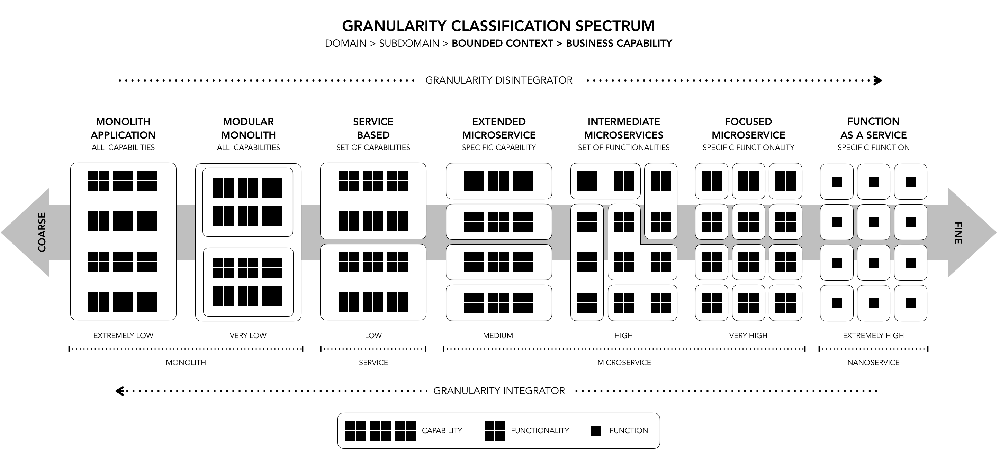

# Granularity Assessment Questionnaire (v1.0)
*(Based on the **Granularity Classification Spectrum – GCS**)*

### Purpose
Help architects and engineers locate a **capability** on the GCS granularity spectrum, which ranges from **Monolith** to **Nanoservice / FaaS**.

### How to Use
For each question, tick the alternative that best describes the capability **today** and record its score. When finished, sum the points and use the table at the end to find the corresponding GCS level.

---

## Questions

| # | Dimension | Question | Alternatives **(points)** |
|---|---|---|---|
| **A&nbsp;·&nbsp;Business Scope** ||||
| 1 | Functional breadth | How many **primary business responsibilities** does the capability contain? | a) More than 3 (0) b) 2–3 (1)  c) Exactly 1, cohesive (2)  d) A single, well-defined function (3) |
| **B&nbsp;·&nbsp;Deployment Scope** ||||
| 2 | Deployment form | How is the capability **packaged and deployed**? | a) Part of one large artifact with several capabilities (0)  b) Single modular application, but no independent deployment (1)  c) Stand-alone service (container/VM) (2)  d) Serverless function / FaaS (3) |
| 3 | Release frequency | The capability is released… | a) Together with a large batch of features (0)  b) With 2–3 related capabilities (1)  c) Independently (2)  d) On demand / event-triggered (3) |
| **C&nbsp;·&nbsp;Independence & Coupling** ||||
| 4 | Database ownership | Does the capability have its **own database/schema**? | a) Shared with several functions (0)  b) Shared DB, but separate schemas (1)  c) Exclusive database (2)  d) Stores only transient or no state (3) |
| 5 | External integrations | **Number of integration points** required for its main logic | a) > 6 (0)  b) 4–6 (1)  c) 2–3 (2)  d) 0–1 (3) |
| **D&nbsp;·&nbsp;Internal Complexity** ||||
| 6 | Code size ¹ | Approximate lines of code | a) > 25k (0)  b) 10–25k (1)  c) 3–10k (2)  d) < 3k (3) |
| 7 | Cohesion | Classes / modules address… | a) Heterogeneous business domains (0)  b) A broad but related domain (1)  c) A focused domain with few variations (2)  d) One specialized function (3) |
| **E&nbsp;·&nbsp;Organization & Teams** ||||
| 8 | Team ownership | How many **teams maintain** this capability? | a) More than 3 (0)  b) 2–3 (1)  c) A dedicated team (2)  d) Less than one FTE; maintained “as code” (3) |
| 9 | Decision autonomy | To evolve the capability, the team depends on… | a) Central governance + multiple approvals (0)  b) 2–3 groups (1)  c) Only its Product Owner (2)  d) Automation & feature flags (3) |
| **F&nbsp;·&nbsp;Performance & Cost** ||||
| 10 | Scalability | The component scales… | a) Only together with the whole system (0)  b) With 2–3 related services (1)  c) Independently (2)  d) Elastically per invocation (3) |
| 11 | Operational overhead ² | Current fragmentation incurs **coordination cost** that is… | a) Low because everything is local (0)  b) Medium (1)  c) Noticeable but controlled (2)  d) High; remote calls dominate **(subtract 1 point)** |
| **G · Observability** ||||
| 12 | Monitoring & Debugging | How are the capability's health and behavior observed? | a) Manual logs in files or without a standard (0) b) Centralized metrics and logs, but reactive (1) c) Distributed tracing and proactive alerts implemented (2) d) Business metrics (SLOs) and real-time debugging are fully automated (3) |

> ¹ Code size may be replaced by metrics like **LOC**, **CYC**, or similar.
>
> ² **Note on Question 11:** Alternative (d) subtracts 1 point to signal that fragmentation may have reached a detrimental level (granularity saturation), where the communication cost between services outweighs the benefits of their independence.

---

## Scoring & GCS Mapping

1.  **Add up** the points (maximum score = **35**).
2.  **Locate** the total in the table below to determine the granularity level.

| Total | GCS Level | Quick Interpretation |
|---|---|---|
| 0–5 | **Monolith** | Capability is part of one big block – consider initial extraction. |
| 6–10 | **Modular Monolith** | Clear internal boundaries but no independent deployment. |
| 11–15 | **Service-Based** | Still large services; early sub-domain hints, low isolation. |
| 16–20 | **Microservice – Extended** | One capability per service; few external dependencies. |
| 21–25 | **Microservice – Intermediate** | Service covers a cohesive subset; integrates with several peers. |
| 26–30 | **Microservice – Focused** | Isolated function, high cohesion and independence. |
| 31–35 | **Nanoservice / FaaS** | Maximum fragmentation, event-driven execution – watch for saturation. |

---

## Additional Usage Guidelines

* **Triangulate metrics.** Combine this questionnaire with other indicators (size, effort, cost, code, etc.) to strengthen the diagnosis.
* **Repeat periodically.** The GCS supports **continuous granularity reviews** as the architecture evolves.
* **Watch for saturation.** Scores in the 31–35 range, coupled with sharp increases in remote invocation intensity, may signal **granularity saturation**, calling for service consolidation.